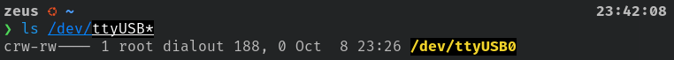
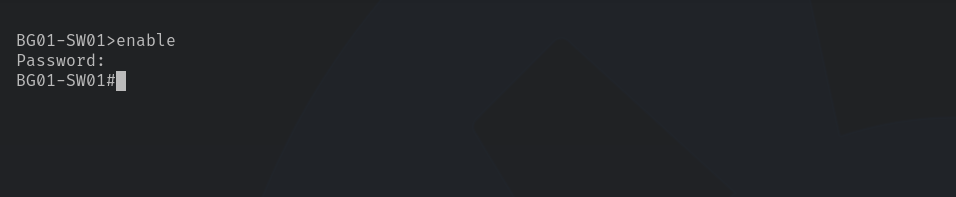

# Lab 01 Configuration Setup Documentation

This document will cover the configuration of the deployment bags for lab01. The documentation will consist of configuring two student VLANs, a management VLAN, and blocking access to port 24 for all MACs except TA MACs to use the port as a failsafe management ethernet connection.

## Discovery, & Connection to PuTTY or Switch

Regarding this documentation, it will follow a configuration for switch connection via the terminal, but PuTTY can also be used in this case.

Find the serial device name:

From the terminal, run `ls /dev/ttyUSB*` for Unix-based systems. This command will print the interface of the serial connection in order to receive console connection.

Connect to the switch:

Using this information, connection can either be established from the terminal or via a serial console such as PuTTY. If connecting via the terminal, run `sudo screen /dev/ttyUSB0 9600`, using the command output for the number following USB. For PuTTY, click the serial button, type the path listed above, then click connect.

From the terminal, click entire a few times. Eventually a command line with the hostname of the switch should appear on the screen. In this example, the hostname resembles `BG01-SW01`. This means the terminal is now connected to the switch.

### Entering Executive Mode

Next, in order to make any changes, the switch interface needs to be in privileged/EXEC mode. Execute this by running a simple `enable` command.

When entering EXEC mode, the switch will prompt for a password. If you do not know the password, please see Tyler. Entrance into EXEC mode is confirmed by seeing the pound (#) key next to the hostname. In this configuration, `BG01-SW01#`
